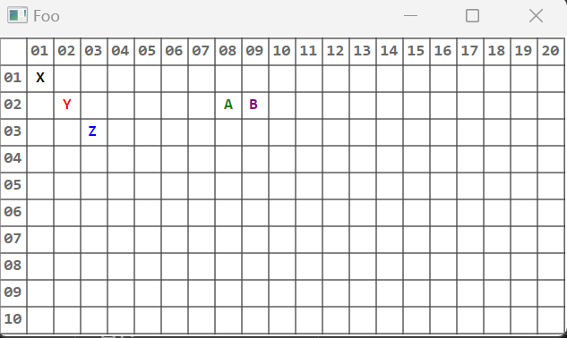

# LeoBoard

A simple 2D board for creating applications like minesweeper.

Supports:

* Customizable board size
* Drawing grid numbers
* Setting Text content with colors
* Click handler for left- and right