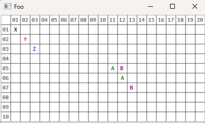

# LeoBoard

A utility library for creating simple, grid based UI application like Minesweeper, Chess, etc.

Allows to draw a grid with specified size, optional row and column numbers, and content for each cell.
Left- and right-click events are captured and can be handled to update the cell content.

## Sample usage

```csharp
await Board.Initialize("Demo", 10, 20, 
                       clickHandler: HandleClick,
                       drawGridNumbers: true);

Board.SetCellContent(0, 0, "X");
Board.SetCellContent(1, 1, "Y", Brushes.Red);
Board.SetCellContent(2, 2, "Z", Brushes.Blue);

Console.ReadKey();

void HandleClick(int row, int col, bool leftClick)
{
    Console.WriteLine($"Clicked cell ({row}, {col}) with {(leftClick ? "left" : "right")} mouse button");
    if (leftClick)
    {
        Board.SetCellContent(row, col, "A", Brushes.Green);
    }
    else
    {
        Board.SetCellContent(row, col, "B", Brushes.Purple);
    }
}
```

- The `Console.ReadKey()` call is required to keep the hosting console application alive
  - Mind the `await` for the `Initialize` method
- Allow for a few seconds for the window to appear (some async initialization is happening)

